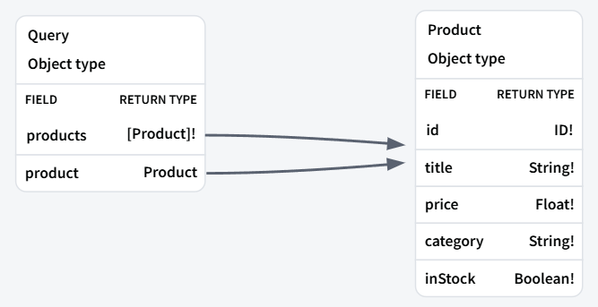
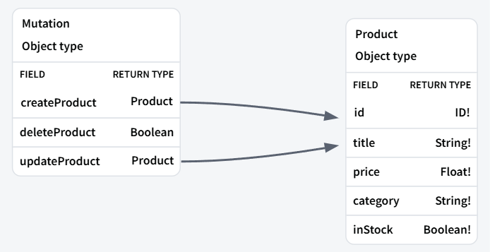

# 🧠 GraphQL Node.js Apollo Server

   

---

## Table of Contents

- [🧠 GraphQL Node.js Apollo Server](#-graphql-nodejs-apollo-server)
  - [Table of Contents](#table-of-contents)
  - [🧩 Introduction](#-introduction)
  - [🗂️ Project Structure](#️-project-structure)
  - [🧾 Problem Description](#-problem-description)
    - [✅ Examples](#-examples)
    - [⚠️ Constraints](#️-constraints)
  - [🚀 Approach](#-approach)
  - [🖼️ Visualization](#️-visualization)
    - [🎯 GraphQL Operation Types](#-graphql-operation-types)
  - [🧠 Detailed Explanation of Code](#-detailed-explanation-of-code)
    - [📘 Schema Definition (`schema.js`)](#-schema-definition-schemajs)
    - [🧮 Resolvers (`resolvers.js`)](#-resolvers-resolversjs)
    - [🌐 Server Setup (`server.js`)](#-server-setup-serverjs)
  - [🧮 Complexity Analysis](#-complexity-analysis)
  - [▶️ How to Run the Code](#️-how-to-run-the-code)
    - [1. Clone the repository](#1-clone-the-repository)
    - [2. Install dependencies](#2-install-dependencies)
    - [3. Run the server](#3-run-the-server)
    - [4. Access GraphQL Playground](#4-access-graphql-playground)
  - [🏁 Conclusion](#-conclusion)

---

## 🧩 Introduction

GraphQL is a **query language for APIs** and a **runtime** for executing those queries with your existing data. It offers clients the ability to:

- Request exactly the data they need (and nothing more).
- Aggregate data from multiple sources into a single request.
- Receive predictable results via type-checking and schema validation.

Apollo Server is a **community-maintained open-source GraphQL server** that works with Node.js.

---

## 🗂️ Project Structure

```plaintext
src/
│
├── data/
│   └── products.js
│
├── graphql/
│   ├── resolvers.js
│   └── schema.js
│
├── screenshots/
│   ├── Mutations.png
│   └── Queries.png
│
└── server.js
```

---

## 🧾 Problem Description

We want to build a simple backend using **GraphQL with Apollo Server** in **Node.js** to manage a list of products with the following operations:

- Get all products
- Get a product by ID
- Create a product
- Update a product
- Delete a product

### ✅ Examples

Querying for all products:

```graphql
query {
  products {
    id
    title
    category
    price
    inStock
  }
}
```

Mutation to create a product:

```graphql
mutation {
  createProduct(
    title: "Smartphone"
    category: "Electronics"
    price: 499.99
    inStock: true
  ) {
    id
    title
  }
}
```

### ⚠️ Constraints

- All products must have unique `id`
- Fields like `title`, `category`, `price`, and `inStock` are mandatory while creating
- `updateProduct` allows partial updates

---

## 🚀 Approach

1. **Define Schema** using GraphQL SDL (`typeDefs`)
2. **Write Resolvers** to handle Queries and Mutations
3. Use **Apollo Server** to serve the GraphQL endpoint
4. Serve the app on `http://localhost:4000/graphql`

---

## 🖼️ Visualization

### 🎯 GraphQL Operation Types

| Operation                                     | Purpose                                           |
| --------------------------------------------- | ------------------------------------------------- |
| `Query`                                       | To **read** or fetch data                         |
| `Mutation`                                    | To **write/update/delete** data                   |
| `Subscription`                                | For **real-time** updates (not used here)         |
| Query                                         | Mutation                                          |
|  |  |

---

## 🧠 Detailed Explanation of Code

### 📘 Schema Definition (`schema.js`)

```js
const { gql } = require("graphql-tag");

const typeDefs = gql`
  type Product {
    id: ID!
    title: String!
    price: Float!
    category: String!
    inStock: Boolean!
  }

  type Query {
    products: [Product]!
    product(id: ID!): Product
  }

  type Mutation {
    createProduct(
      title: String!
      category: String!
      price: Float!
      inStock: Boolean!
    ): Product

    deleteProduct(id: ID!): Boolean

    updateProduct(
      id: ID!
      title: String
      category: String
      price: Float
      inStock: Boolean
    ): Product
  }
`;

module.exports = typeDefs;
```

- `!` means required fields.
- Scalar types used: `ID`, `String`, `Float`, `Boolean`.

---

### 🧮 Resolvers (`resolvers.js`)

```js
const products = require("../data/products");

const resolvers = {
  Query: {
    products: () => products,
    product: (_, { id }) => products.find((p) => p.id === id),
  },

  Mutation: {
    createProduct: (_, { title, category, price, inStock }) => {
      const newProduct = {
        id: String(products.length + 1),
        title,
        category,
        price,
        inStock,
      };
      products.push(newProduct);
      return newProduct;
    },

    deleteProduct: (_, { id }) => {
      const index = products.findIndex((p) => p.id === id);
      if (index === -1) return false;
      products.splice(index, 1);
      return true;
    },

    updateProduct: (_, { id, ...updates }) => {
      const index = products.findIndex((p) => p.id === id);
      if (index === -1) return null;
      const updated = { ...products[index], ...updates };
      products[index] = updated;
      return updated;
    },
  },
};

module.exports = resolvers;
```

- Uses in-memory data from `products.js`.
- Provides logic for all CRUD operations.

---

### 🌐 Server Setup (`server.js`)

```js
const { ApolloServer } = require("@apollo/server");
const { startStandaloneServer } = require("@apollo/server/standalone");

const typeDefs = require("./graphql/schema");
const resolvers = require("./graphql/resolvers");

async function startServer() {
  const server = new ApolloServer({
    typeDefs,
    resolvers,
  });

  const { url } = await startStandaloneServer(server, {
    listen: { port: 4000 },
  });

  console.log("🚀 Server ready at: " + url);
}

startServer();
```

- Launches server at [http://localhost:4000](http://localhost:4000)
- Combines schema and resolvers

---

## 🧮 Complexity Analysis

```md
- Query products: O(n) where n = number of products
- Query product by ID: O(n)
- Create Product: O(1)
- Delete Product: O(n) (due to `findIndex`)
- Update Product: O(n)
```

_In production, a database should be used instead of in-memory arrays to optimize search operations._

---

## ▶️ How to Run the Code

### 1. Clone the repository

```bash
git clone <your-repo-url>
cd graphql-apollo-server
```

### 2. Install dependencies

```bash
npm install
```

### 3. Run the server

```bash
node server.js
```

### 4. Access GraphQL Playground

Open: [http://localhost:4000](http://localhost:4000)

Use the query editor to run queries and mutations.

---

## 🏁 Conclusion

This project is a solid starting point for building powerful, flexible APIs using **GraphQL** with **Apollo Server** and **Node.js**. It allows you to define a schema, perform CRUD operations via queries and mutations, and can be easily extended to include authentication, databases, subscriptions, and more.
